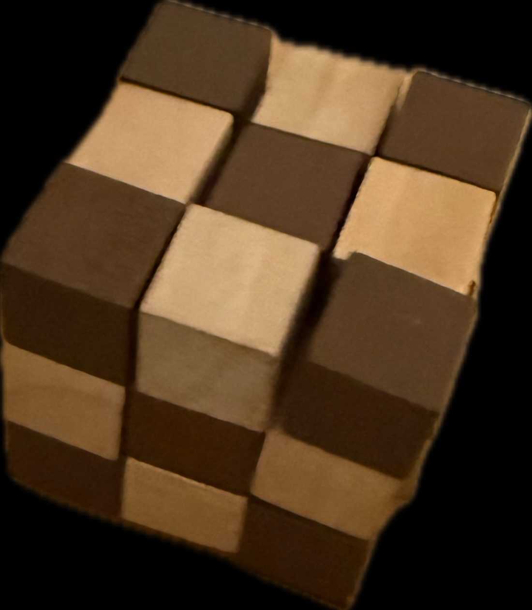

# CubeString

Calcule l'ensemble des solution d'un casse-tête irl : une cordelette enfilée à travers plusieurs petits cubes articulés qu’il faut replier pour former un cube complet ([snake cube](https://blog.thepuzzl.co/how-to-solve-snake-cube/)).


Ce dépôt contient un programme rust qui explore et valide les configurations possibles afin de reconstruire automatiquement le cube complet.

```bash
cargo build --release
./target/release/cubestring
# OR
RUSTFLAGS="-C debuginfo=2 -C force-frame-pointers=yes" cargo build --profile profiling
samply record -- target/profiling/cubestring
```

Pas d'IA utilisée à part pour résoudre quelques problèmes de borrow et de syntaxe. Pourtant la tentation était grande.

## TODO
- Optimiser l'algo
- Générer les contraintes et passer ça à un SMT-solver
- Visualiser la recherche
- La modélisation avec les rotation est vraiment pourrie, on ne peut éviter facilement de créer un chemin qui ne repasse pas par une coordonnée déjà utilisée



